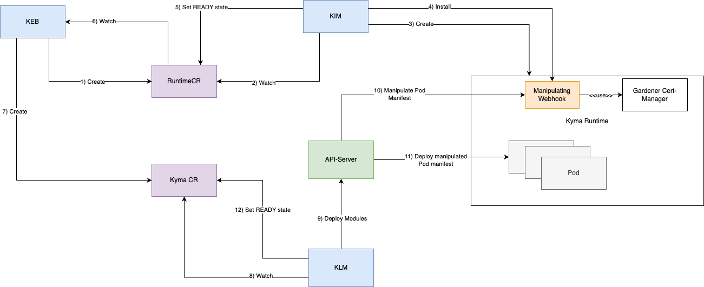

# Runtime Bootstrapper


## Overview
Kyma landscapes can require individual infrastructure setups (e.g. if the landscape runs in a restricted context or market).  This could be a private container registry, a certificate based access mechanisms or other special configurations which make such Kyma landscape unique.

Kyma modules are usually not aware about differences between landscapes and, without any adjustments, they could be functionally limited or even incompatible and not run in such landscapes.

To solve this problem, the Runtime Bootstrapper is responsible to apply landscape specific configurations to Kyma modules, respectively to the workloads installed by the modules.

The Runtime Boostrapper is implemented as manipulating webhook which intercepts create or update requests for Pods before they get applied by Kubernetes `kubelet`. It extends or rewrites parts of the Pod manifests to make them compatible with the landscape.

> **Hint**: Only Pods are intercepted by the webhook! Other resources (like `Deployment`, `DaemonSet` or `StatefulSet` etc.) are ignored.

## Pod Manipulations

The Runtime Bootstrapper modifies a Pod only if one of the following conditions is met:

1. The Pod runs within a namespace which is listed in the Webhook's default configuration. All pods in such namespaces are automatically intercepted and modified. This option is primarily used for namespaces which are Kyma managed (e.g. `kyma-system`, `istio-system` etc.)
2. The namespace contains an annotation which indicates that Pods within the namespace should be intercepted.
3. The Pod itself is annotated to get intercepted by the webhook.

The next section describes the manipulations and their corresponding annotation.

### Applied Manipulations

The following table gives an overview of the different manipulations supported by the Runtime Bootstrapper.

THe column `Opt-In Annotation` contains the annotation which has to be added to an `Namespace` or `Pod`  to enable the webhook manipulation for it (only required if the Pod is **not** running in a Namespace which is per default monitored by the webhook).

|Name|Purpose|Applied Manipulation|Modified Manifest Field|Opt-In Annotation|
|--|--|--|--|--|
|Container Registry Rewrite|The webhook configuration contains a map of container registry hosts which have to be replaced by another host (e.g. if a private container registry should be used). |Rewrite container-registry host in `image` field.|Rewrite registry hosts in `.spec.containers[*].image`|`rt-cfg.kyma-project.io/alter-img-registry: "true"`|
|Image Pull Secret Injection|If the registry requires user credentials, the webhook will make sure that the secret-resource exists in the namespace and add a pull-secret entry to the manifest.|Add secret-reference to the `imagePullSecrets` field if registry requires credentials.|Append array `.spec.imagePullSecrets[]` with entry `registry-credentials` |`rt-cfg.kyma-project.io/add-img-pull-secret: "true"`|
|FIPS mode enablement|The webhook sets an environment variable to the Pod which indicates to run in FIPS mode.|Add environment variable `KYMA_FIPS_MODE_ENABLED`.|  Append key-value array `.spec.containers[*].env[]` with `KYMA_FIPS_MODE_ENABLED=true`|`rt-cfg.kyma-project.io/set-fips-mode: "true"`|
|Mount cluster trust bundle volume|Selected landscapes require a certificate (stored as `ClusterTrustBundle`) to interact with BTP backend services. The `ClusterTrustBundle` will be mounted as projected volume into the container under the path `/etc/ssl/certs` (includes also init-containers).| Mount a projected `volume` from `ClusterTrustBundle` to each container in the pod under path `/etc/ssl/certs`.| 1. Add projected volume `rt-bootstrapper-certs` to `.spec.volumes[]`<br/>2. Mount this volume into each container under the mount path `/etc/ssl/certs` by extending the array `.spec.containers[*].volumeMounts`|`rt-cfg.kyma-project.io/add-cluster-trust-bundle: "true"`|

*Note: if a Pod was manpulated by the webhook, the pod is annotated with `rt-bootstrapper.kyma-project.io/defaulted: "true"`*

### Example

Below a Pod manifest before it was intercepted.

The annotation enables the webhook to 
1. manipulate the image registry
2. add a pull secret (if needed)
3. mount the `ClusterTrustBundle` as projected volume
4. enable the FIPS mode

```
apiVersion: apps/v1
kind: Deployment
metadata:
  name: pause-test1
  labels:
    app: pause-test1
spec:
  replicas: 1
  selector:
    matchLabels:
      app: pause-test1
  template:
    metadata:
      annotations:
        rt-cfg.kyma-project.io/alter-img-registry: "true"
        rt-cfg.kyma-project.io/add-img-pull-secret: "true"
        rt-cfg.kyma-project.io/add-cluster-trust-bundle: "true"
        rt-cfg.kyma-project.io/set-fips-mode: "true"
      labels:
        app: pause-test1
    spec:
      containers:
      - name: pause
        image: replace.me/kyma-project/rt-bootstrapper/pause:e2e
```

The pod manifest after it was processed by the webhook:

```
apiVersion: v1
kind: Pod
metadata:
  name: pause-test1
  labels:
    app: pause-test1
  annotations:
    rt-bootstrapper.kyma-project.io/defaulted: "true"
    rt-cfg.kyma-project.io/add-cluster-trust-bundle: "true"
    rt-cfg.kyma-project.io/add-img-pull-secret: "true"
    rt-cfg.kyma-project.io/alter-img-registry: "true"
    rt-cfg.kyma-project.io/set-fips-mode: "true"
spec:
  containers:
  - env:
    - name: KYMA_FIPS_MODE_ENABLED.                            # FIPS mode enabled
      value: "true"
    image: ghcr.io/kyma-project/rt-bootstrapper/pause:e2e.     # Registry host rewritten
    name: pause
    volumeMounts:                                              # ClusterTrustBundle as volume mounted
    - mountPath: /etc/ssl/certs
      name: rt-bootstrapper-certs
      readOnly: true
  imagePullSecrets:                                            # image-pull secret injected
  - name: registry-credentials
  volumes:
  - name: rt-bootstrapper-certs
    projected:
      defaultMode: 420
      sources:
      - clusterTrustBundle:
          name: rt-bootstrapper-k3d.test:ctb:1
          path: kube-apiserver-serving.pem
```

## High Level Flow



1. KEB (Kyma Environment Broker) creates a `Runtime` CR (it represents a Kyma runtime instance).
2. KIM (Kyma Infrastructure Manager) watches all changes of `Runtime` CRs.
3. When a new `Runtime` CR gets created, KIM creates a new Kyma runtime (based on Gardener Cluster).
4. After the Kyma runtime is ready, the Runtime Bootstrapper Webhook is automatically installed by KIM.
5. When the webhook is running, KIM marks the `Runtime` CR to be ready.
6. KEB watchers status changes of `Runtime` CRs.
7. As next steps, after the Kyma runtime is ready, KEB creates a `Kyma` CR (represents a Kyma installation on a Kyma runtime).
8. KLM (Kyma Lifecycle Manager) watches `Kyma` CR and reacts on new created entities.
9. KLM starts deploying Kyma modules via the API server.
10. The API server calls the manipulating webhooks to intercept requests.
11. The manipulated request gets deployed on the Kyma runtime.
12. After all Kyma modules were successfully installed, KLM marks the `Kyma` CR as ready.

## Useful Links (Optional)
* [Architectural decision](../contributor/architectural-decisions.md)
